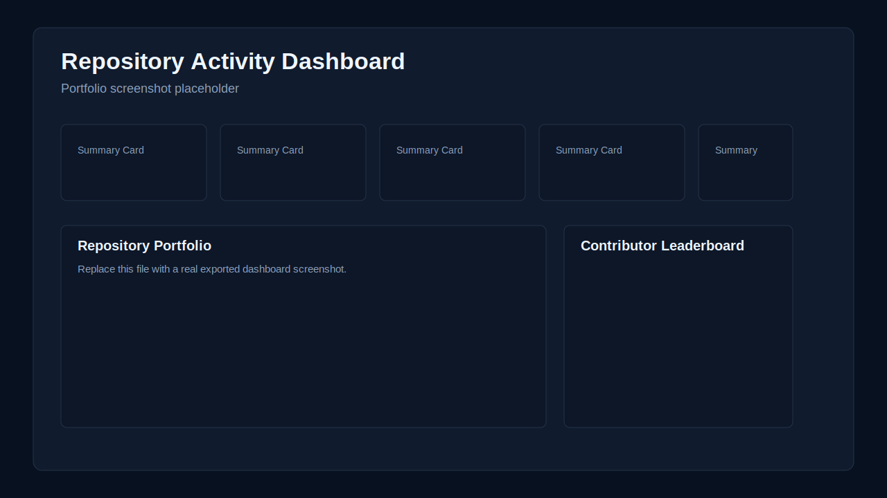
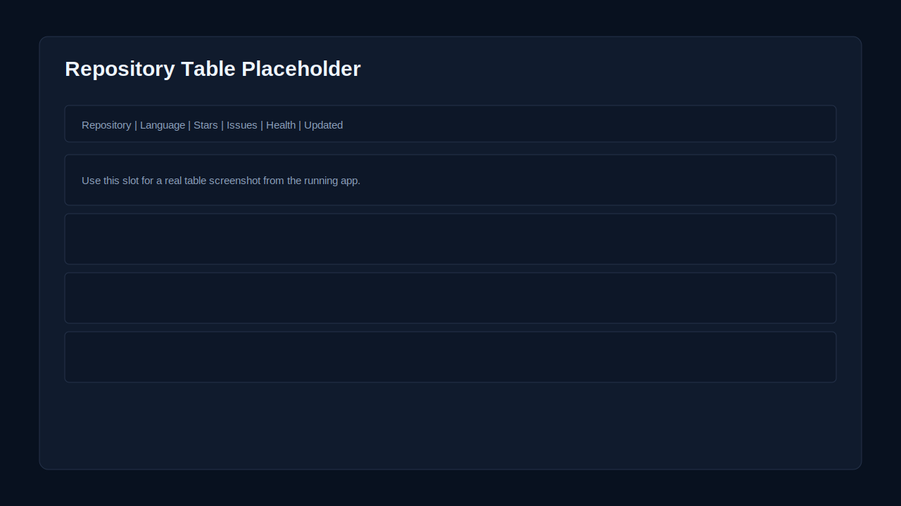
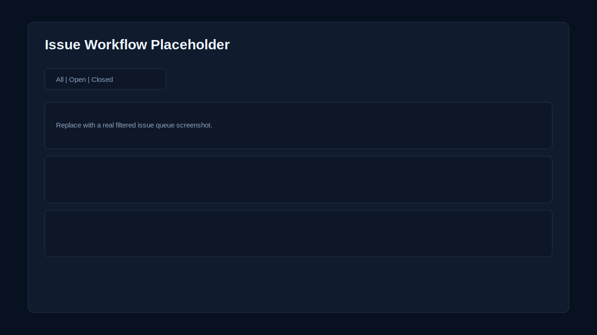

# REST API Integration and Backend Workflow

Repository Activity Dashboard built with **FastAPI**, **React**, **TypeScript**, and **Tailwind CSS** to demonstrate third-party API integration, backend workflow design, data normalization, caching, error handling, and dashboard delivery.

## Business Framing

This project is positioned as a realistic internal operations dashboard for teams that rely on third-party systems but do not want frontend code talking directly to raw vendor APIs. It shows how a backend can absorb external API complexity, transform public data into business-ready records, and expose stable internal endpoints that are easier to maintain.

For freelance positioning, the project maps directly to client work such as:

- REST API integration
- backend workflow development
- third-party system integration
- data validation and normalization
- dashboard-oriented API design
- troubleshooting API-driven applications

## Problem / Solution / Result

### Problem

Public APIs are useful, but real products rarely want to consume them directly. Raw external responses can be noisy, inconsistent, rate-limited, and too coupled to a vendor's schema. Frontends also should not own retry logic, caching, response shaping, and business transformations.

### Solution

This project adds a backend integration layer between GitHub's public API and a frontend dashboard:

- fetches repository, issue, contributor, and activity data from GitHub
- validates responses with Pydantic schemas
- normalizes raw records into stable internal models
- applies aggregation, filtering, and presentation-friendly transformations
- caches responses to reduce repeated calls and rate-limit pressure
- handles upstream failures with structured error payloads and stale-cache fallback
- exposes clean dashboard endpoints tailored for UI consumption

### Result

The final result is a believable internal business dashboard with a production-minded architecture. It demonstrates the kind of work clients expect when they hire for API integration and backend workflow engineering, while still presenting well on GitHub, Upwork, and a personal portfolio.

## Portfolio Summary

- **Project type:** full-stack portfolio case study
- **Use case:** repository activity monitoring and operational reporting
- **External API:** GitHub REST API
- **Backend value-add:** validation, normalization, aggregation, retry logic, caching, graceful failure handling
- **Frontend value-add:** typed data consumption, responsive dashboard UI, filtering, loading and error states

## Screenshots

These are clean placeholder references that can be replaced with real screenshots later without changing the README structure.

### Dashboard Overview



### Repository Table



### Issue Workflow



## Sample Data

The repo includes realistic sample dashboard output for portfolio review and documentation:

- [Full dashboard payload](docs/sample-data/dashboard-response.json)

This is useful when:

- showing the data contract without requiring the app to run
- discussing schema shape with clients
- demonstrating the difference between raw third-party data and internal normalized output

## What the Backend Adds Beyond Raw API Consumption

Instead of sending GitHub responses straight to the frontend, the backend provides a cleaner internal contract:

- repository records are normalized into a stable schema
- issue payloads exclude pull requests and include derived priority and age fields
- contributor records are aggregated across repositories for leaderboard-style views
- event types are translated into more business-friendly activity labels
- summary metrics are precomputed for dashboard cards
- caching reduces repeated upstream requests
- retries and timeouts improve resilience
- structured error payloads make failure handling predictable

## Architecture

```text
backend/
  app/
    api/routes/          FastAPI route layer
    clients/             GitHub REST API client with timeout/retry handling
    core/                configuration and cache utilities
    schemas/             external GitHub and internal dashboard schemas
    services/            normalization, aggregation, filtering, transformations
    main.py              FastAPI app setup

frontend/
  src/
    api/                 typed dashboard API client
    types.ts             frontend data contracts
    App.tsx              dashboard UI, filtering, states, responsive views

docs/
  sample-data/           example normalized API output
  screenshots/           placeholder portfolio screenshots
```

## Feature Highlights

### Backend

- GitHub public API integration
- timeout and retry handling
- schema validation with Pydantic
- normalization and aggregation services
- in-memory TTL cache with stale fallback support
- dashboard-specific internal endpoints
- structured error responses for UI consumption

### Frontend

- dark professional dashboard design
- summary cards, repository table, issue workflow panel, contributor leaderboard, activity feed
- typed data models and API client
- search and issue-state filtering
- clean loading, empty, warning, and error states
- responsive layout for desktop and mobile

## Backend Endpoints

Base URL: `http://127.0.0.1:8000`

- `GET /health`
- `GET /api/dashboard/summary`
- `GET /api/dashboard/repos`
- `GET /api/dashboard/issues`
- `GET /api/dashboard/contributors`
- `GET /api/dashboard/activity`

Example queries:

- `/api/dashboard/repos?search=fastapi`
- `/api/dashboard/issues?state=open&priority=high&limit=20`
- `/api/dashboard/activity?repo=fastapi/fastapi`
- `/api/dashboard/summary?repositories=fastapi/fastapi,encode/httpx`

## External API

The backend integrates with the [GitHub REST API](https://docs.github.com/en/rest) using public endpoints for:

- repository details
- issues
- contributors
- recent repository events

No authentication is required for basic local use, but adding `GITHUB_TOKEN` is recommended to increase rate limits.

## Local Setup

### Backend

```bash
cd backend
python -m venv .venv
.venv\Scripts\activate
pip install -r requirements.txt
uvicorn app.main:app --reload
```

Optional environment variables:

```bash
set GITHUB_TOKEN=your_github_token
set DASHBOARD_REPOSITORIES=fastapi/fastapi,encode/httpx,pydantic/pydantic,vitejs/vite
set CACHE_TTL_SECONDS=300
set STALE_CACHE_TTL_SECONDS=1800
set CORS_ORIGINS=http://localhost:5173,http://127.0.0.1:5173
```

### Frontend

```bash
cd frontend
npm install
npm run dev
```

The Vite app runs at `http://localhost:5173` and expects the backend at `http://127.0.0.1:8000`.

To point the frontend to a different backend:

```bash
set VITE_API_BASE_URL=http://127.0.0.1:8000
```

## Production Build

Frontend:

```bash
cd frontend
npm run build
```

Backend:

```bash
cd backend
uvicorn app.main:app --host 0.0.0.0 --port 8000
```

## Deployment Approach

A typical deployment would separate the backend and frontend:

- Backend on Render, Railway, Fly.io, Azure App Service, AWS ECS, or a VPS
- Frontend on Vercel, Netlify, Cloudflare Pages, or behind the same reverse proxy
- `GITHUB_TOKEN` configured as a backend secret
- `VITE_API_BASE_URL` injected at frontend build time
- `CORS_ORIGINS` restricted to the deployed frontend domain
- Redis substituted for the in-memory cache if running multiple backend instances

## Why This Works as a Portfolio Piece

This project is strong for GitHub, Upwork, and a personal portfolio because it demonstrates both technical depth and client-facing relevance:

- it solves a recognizable integration problem
- it uses a real public API instead of a toy local-only workflow
- it shows backend engineering discipline, not only frontend polish
- it presents data in a business-readable dashboard instead of raw JSON
- it documents the architecture and value proposition clearly for non-technical buyers

## License

This repository is available under the [MIT License](LICENSE).
